# IntegrityCore Architecture — Detailed Mermaid Diagrams

## 1. System Context (C4 Level 1)

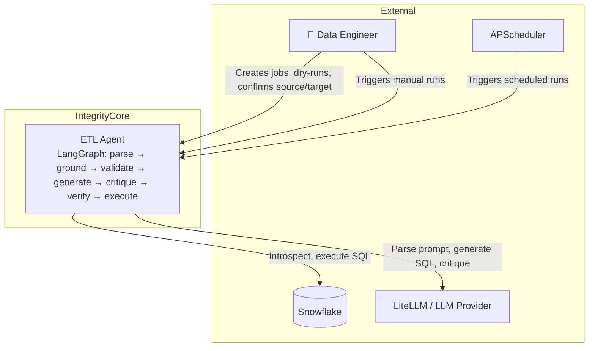

---

## 2. High-Level Component Architecture

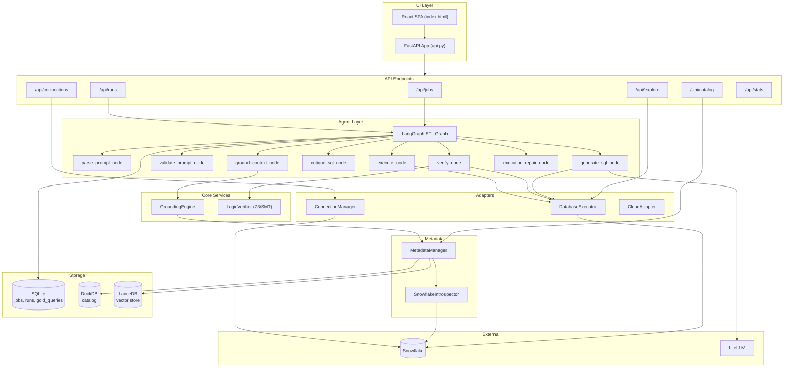

---

## 3. ETL Graph Flow (Detailed)

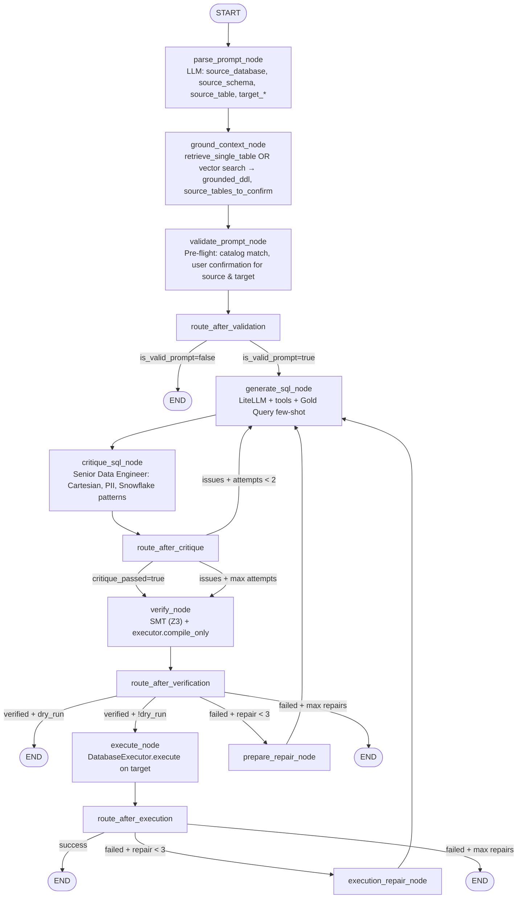

---

## 4. ETL State Machine (ETLState)

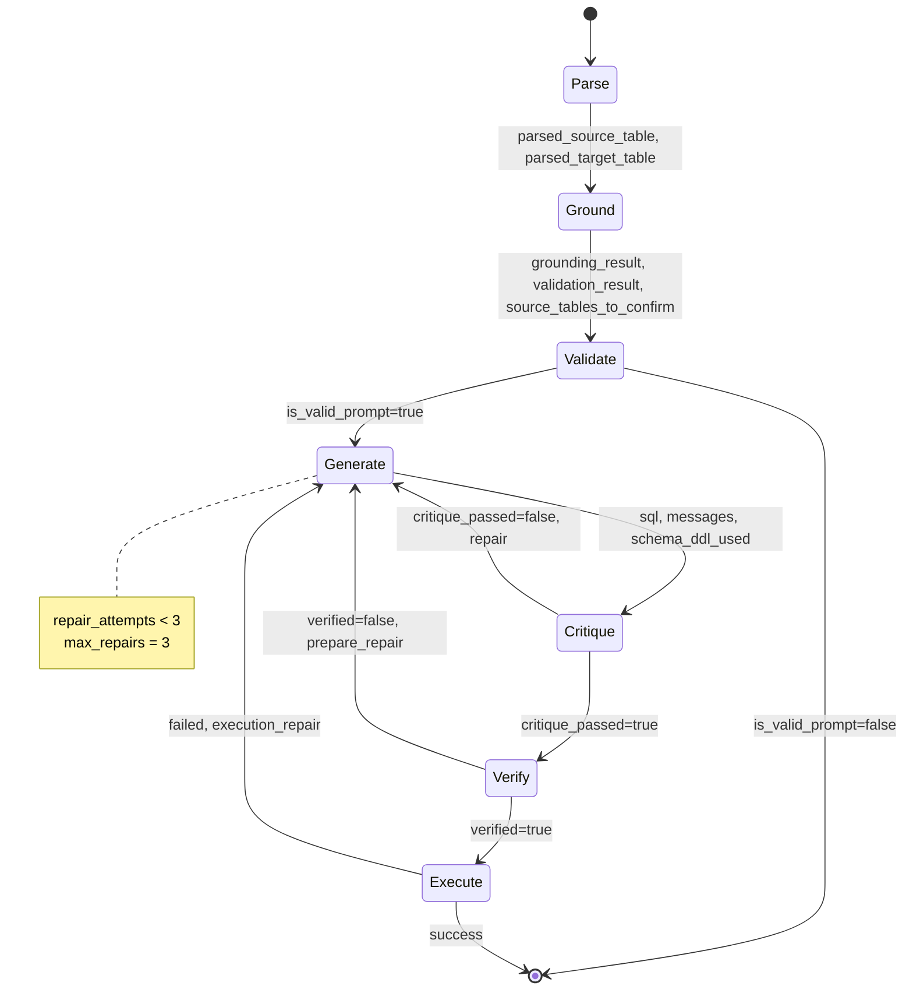

---

## 5. Data Model (Entity Relationship)

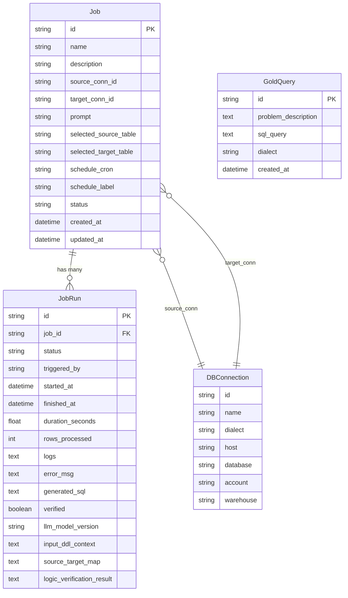

---

## 6. ETL Graph State (ETLState TypedDict)

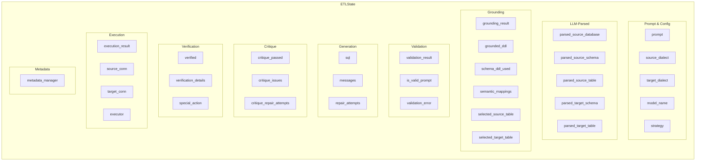

---

## 7. API Endpoints Map

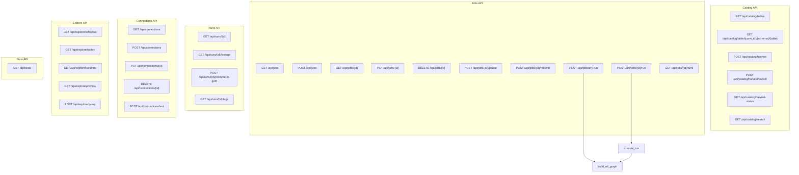

---

## 8. Grounding Engine Flow

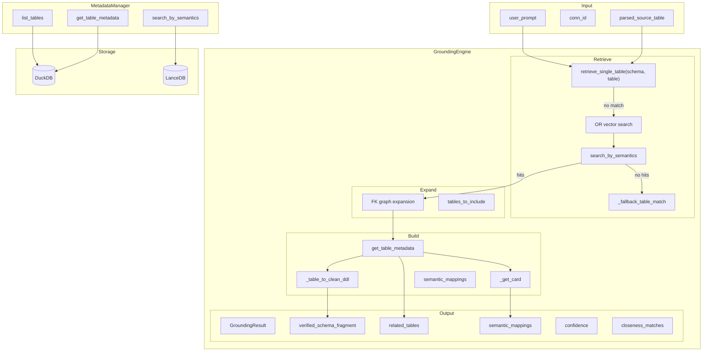

---

## 9. Dry Run vs Execution Flow

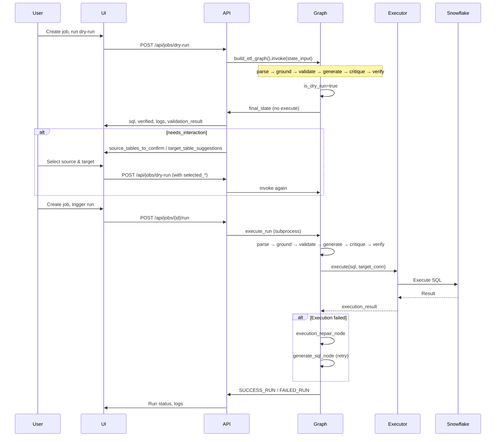

---

## 10. Scheduler & Runner Flow

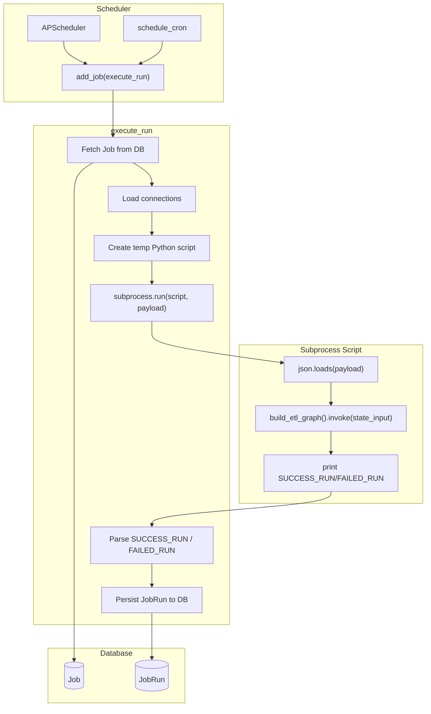

---

## 11. External Integrations

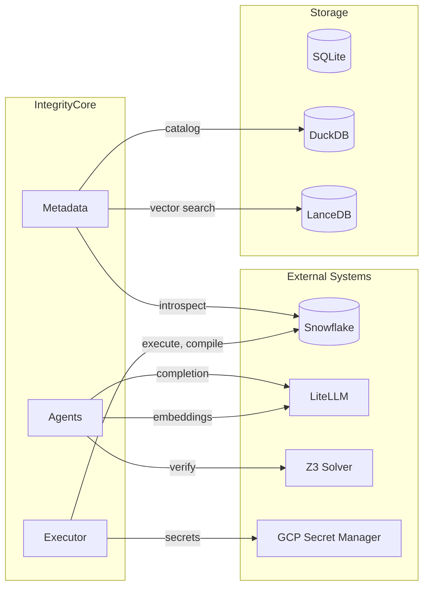

---

## 12. Module Dependency Graph

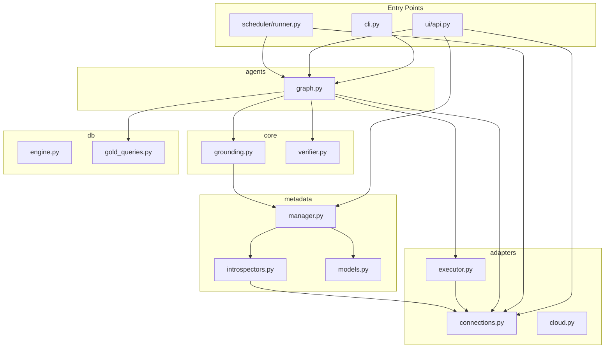

---

## Usage

Copy any diagram block into a Mermaid-compatible viewer (e.g. [Mermaid Live Editor](https://mermaid.live), GitHub, Notion, Confluence) to render.
